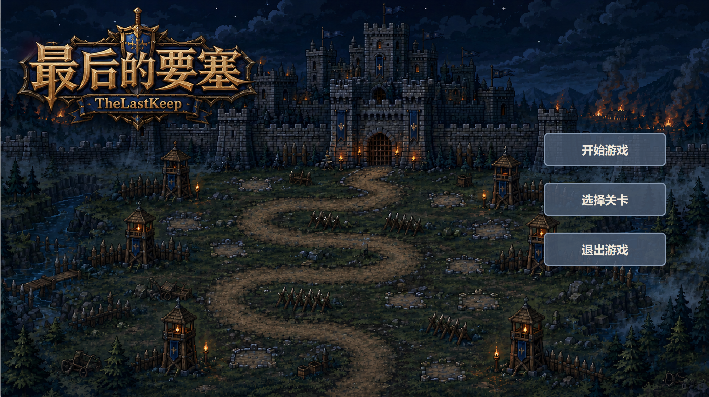
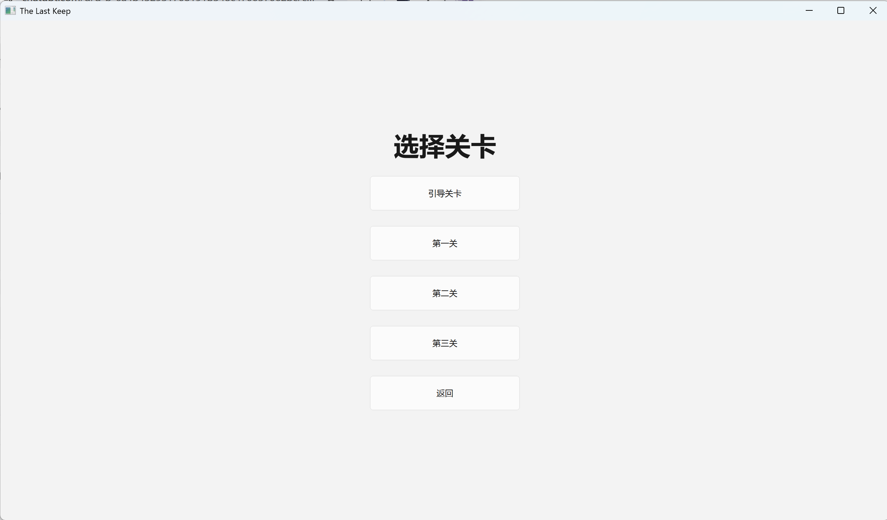
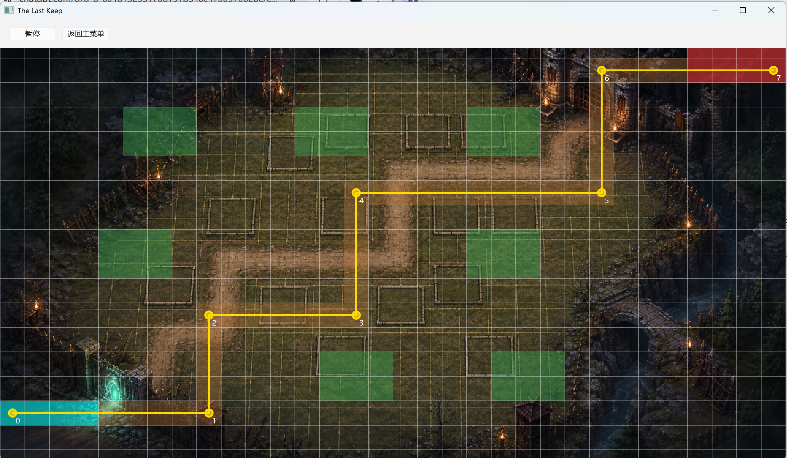
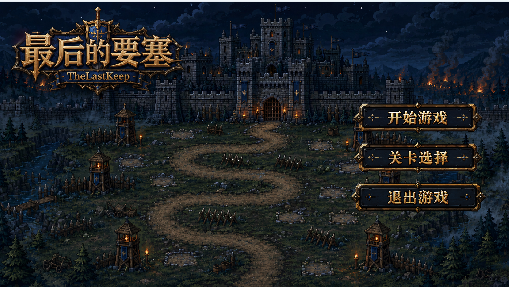

# 7月10日开发文档

## 任务拆分

根据架构设计，今天需要完成以下任务：

1. `MainWindow` 只负责 `QStackedWidget` 页面切换；
2. `GamePage` 负责承载 `QGraphicsView` + `GameScene` + `GameController`；
3. `GameController` 统一管理 `QTimer` 的开始、暂停、恢复、停止，避免切页面后定时器还在跑。

现在的旧代码里，`MainWindow` 还直接创建了 `GameScene` 和 `QGraphicsView`，并且直接调用 `m_scene->loadTutorialLevel()`；`GameScene` 里还创建了“开始游戏 / 退出游戏”按钮并发信号。这个就是现在要拆开的核心问题。

第一阶段的目标结构

```
MainWindow                             页面切换
└── QStackedWidget                     
    ├── StartPage                      负责开始界面的按钮和相关内容接入
    ├── LevelSelectPage                负责关卡选择界面
    ├── GamePage负责游戏页面容器以及页面隐藏/显示时GameController暂停/恢复。           
    │   ├── QGraphicsView
    │   ├── GameScene                 只负责画布、地图显示、鼠标点击转发。
    │   └── GameController
    └── ResultPage
```

## 完成情况与验收

- 编写完了 `MainWindow`、`StartPage`、`LevelSelectPage`、`GamePage`、`ResultPage` 的基本框架，完成了 `GameController` 的定时器管理功能。
- 修改了 `GameScene`，去掉了“开始游戏 / 退出游戏”按钮的创建和信号发射，改为由 `StartPage` 和 `ResultPage` 来处理这些逻辑。







> 目前可以流畅切换界面

同时，将主界面按钮更换为适配游戏的贴图版本。

