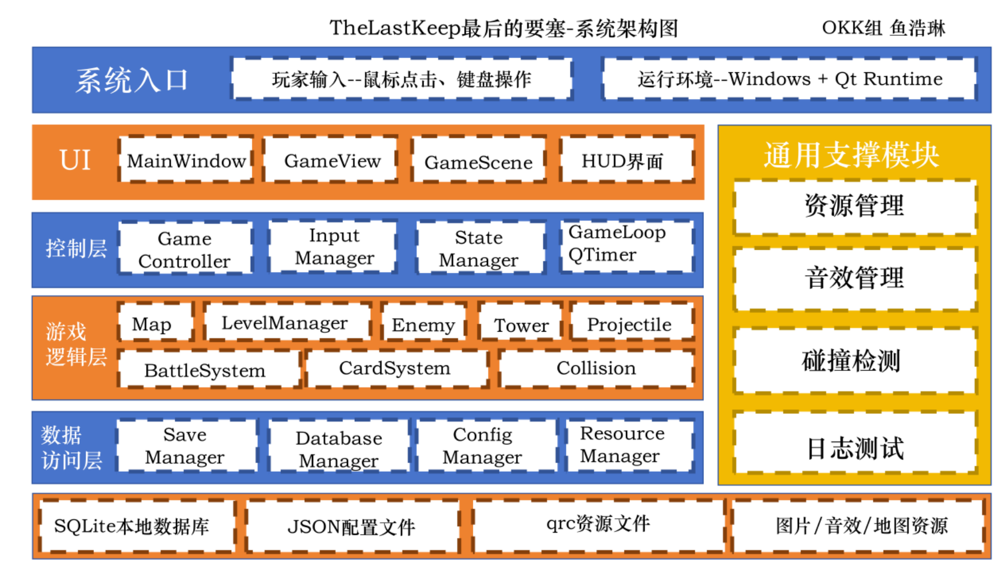

# 重构相关说明

鱼浩琳 2026/07/09

## 原因说明

经过两天的开发，在现有的技术水平和团队协作能力下，难以保证整体的代码质量和可维护性。为了提高代码的可读性、可维护性和扩展性，决定进行代码重构。

## 重构目标

1. 提高代码的可读性：通过重构，使代码结构更加清晰，命名更加规范，减少冗余代码。
2. 提高代码的可维护性：通过模块化设计和分层结构，使代码更容易理解和修改，减少耦合度。
3. 提高代码的扩展性：通过设计模式和接口抽象，使代码更容易扩展和适应未来的需求变化。

> 说人话就是，更简单点，更好些一些，现在乱七八糟的，功能不够模块化，很难维护和修改。

## 重构后的项目结构

```
TheLastKeep
├─ CMakeLists.txt
├─ resources
│  ├─ resources.qrc
│  ├─ images
│  ├─ sounds
│  └─ maps
│
└─ src
   ├─ main.cpp
   │
   ├─ common
   │  ├─ GameTypes.h
   │  ├─ GameConstants.h
   │  └─ Result.h
   │
   ├─ ui
   │  ├─ MainWindow.h
   │  ├─ MainWindow.cpp
   │  │
   │  ├─ pages
   │  │  ├─ StartPage.h
   │  │  ├─ StartPage.cpp
   │  │  ├─ LevelSelectPage.h
   │  │  ├─ LevelSelectPage.cpp
   │  │  ├─ GamePage.h
   │  │  ├─ GamePage.cpp
   │  │  ├─ ResultPage.h
   │  │  └─ ResultPage.cpp
   │  │
   │  └─ widgets
   │     ├─ HUDWidget.h
   │     ├─ HUDWidget.cpp
   │     ├─ CardSelectWidget.h
   │     ├─ CardSelectWidget.cpp
   │     ├─ PauseOverlay.h
   │     └─ PauseOverlay.cpp
   │
   ├─ scene
   │  ├─ GameScene.h
   │  └─ GameScene.cpp
   │
   ├─ core
   │  ├─ GameController.h
   │  ├─ GameController.cpp
   │  ├─ StateManager.h
   │  ├─ StateManager.cpp
   │  ├─ BattleSystem.h
   │  ├─ BattleSystem.cpp
   │  ├─ CollisionSystem.h
   │  └─ CollisionSystem.cpp
   │
   ├─ map
   │  ├─ GameMap.h
   │  ├─ GameMap.cpp
   │  └─ Tile.h
   │
   ├─ level
   │  ├─ LevelData.h
   │  ├─ LevelData.cpp
   │  ├─ LevelManager.h
   │  └─ LevelManager.cpp
   │
   ├─ entity
   │  ├─ Enemy.h
   │  ├─ Enemy.cpp
   │  ├─ Tower.h
   │  ├─ Tower.cpp
   │  ├─ Bullet.h
   │  ├─ Bullet.cpp
   │  ├─ Castle.h
   │  └─ Castle.cpp
   │
   ├─ card
   │  ├─ Card.h
   │  ├─ Card.cpp
   │  ├─ CardManager.h
   │  └─ CardManager.cpp
   │
   └─ data
      ├─ ResourceManager.h
      ├─ ResourceManager.cpp
      ├─ ConfigManager.h
      ├─ ConfigManager.cpp
      ├─ SaveManager.h
      ├─ SaveManager.cpp
      ├─ SoundManager.h
      └─ SoundManager.cpp
```

这一版的项目结构将代码按照功能模块进行了划分，每个模块负责特定的功能，减少了代码之间的耦合，提高了代码的可维护性和可扩展性。
我们的开发将尽力按照项目架构图来进行开发，确保代码的规范性和一致性。

