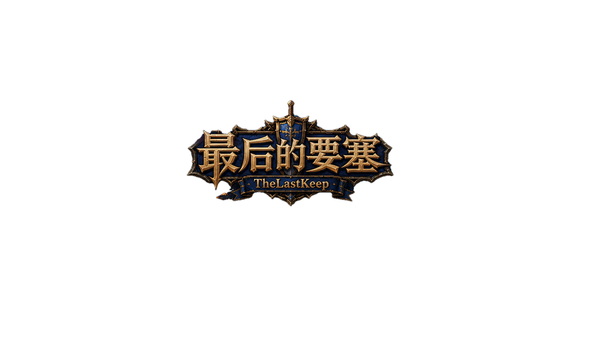

# 🏰 The Last Keep · 最后的要塞

> 一款基于 **Qt 6 + C++** 的经典 2D 塔防游戏。建造防御塔，抵御一波波敌人的进攻，守护最后一座要塞！



---

## 🎮 游戏下载

| 平台 | 下载链接 | 说明 |
|------|----------|------|
| 🪟 Windows x64 | [📥 点击下载](https://github.com/yuhaolin-79/TheLastKeep/releases) | 解压即玩，无需安装 Qt |

> 💡 前往 [GitHub Releases](https://github.com/yuhaolin-79/TheLastKeep/releases) 页面下载最新版本压缩包，解压后双击 `TheLastKeep.exe` 即可运行。

---

## 📖 游戏介绍

在遥远的幻想大陆上，黑暗势力卷土重来。作为最后的守护者，你必须在要塞前的战略要地上建造防御塔，合理搭配不同类型的塔和升级卡牌，击退一波又一波的敌人，保卫人类最后的希望——**最后的要塞**。

### 🎯 核心玩法

```
建造防御塔 → 击杀敌人获取金币 → 波次间隙选择强化卡牌 → 迎接更强敌人 → 守卫要塞！
```

1. **建造防御塔** — 在地图的可建造区域点击放置防御塔，每种塔有不同的攻击特性
2. **迎击敌人** — 每波敌人沿固定路线前进，防御塔自动攻击范围内的敌人
3. **收集金币** — 击杀敌人获得金币，用于建造更多防御塔
4. **选择卡牌** — 每波结束后从 3 张随机卡牌中选择一张，获得永久 Buff 加成
5. **守卫要塞** — 敌人到达城堡会扣除血量，城堡血量归零则游戏失败

---

## 🗺️ 游戏内容

### 关卡

| 关卡 | 名称 | 难度 | 地图特点 |
|------|------|------|----------|
| 教学关 | 初识战场 | ⭐ | 单条路径，熟悉基本操作 |
| 第一关 | 林间小道 | ⭐⭐ | 蜿蜒路径，多个建造点 |
| 第二关 | 荒野岔路 | ⭐⭐⭐ | 双路径汇合，需合理布防 |
| 第三关 | 最终防线 | ⭐⭐⭐⭐ | 复杂路线，敌人更强 |

### 防御塔

| 防御塔 | 特性 | 优势 |
|--------|------|------|
| 🏹 箭塔 | 均衡输出 | 攻速快，性价比高 |
| 🔮 法师塔 | 高伤害 | 单发伤害高，攻击间隔较长 |
| 💣 炮塔 | 范围溅射 | 对群体敌人效果显著 |
| ❄️ 冰塔 | 减速敌人 | 控制敌人移动速度 |
| ✨ 圣塔 | 克制亡灵 | 对特定敌人有额外伤害 |

### 敌人

| 敌人 | 特性 |
|------|------|
| 👺 哥布林 | 基础敌人，属性均衡 |
| 🛡️ 重甲兵 | 高血量，移动缓慢 |
| 🐺 狼骑兵 | 低血量，移动极快 |
| 🧙 术士 | 魔法抗性，中等属性 |
| 👹 Boss（恶魔狼） | 超高血量，真正的挑战 |

### 卡牌 Buff 系统

每波敌人被消灭后，会从以下卡牌中随机抽取 3 张供你选择：

| 卡牌 | 效果 | 叠加 |
|------|------|------|
| ⚔️ 伤害提升 | 所有塔伤害 +15% | 可多次叠加 |
| 💰 建造折扣 | 建造费用 -10% | 可多次叠加 |
| 🪙 金币加成 | 击杀金币 +20% | 可多次叠加 |
| 🎯 范围扩大 | 攻击范围 +10% | 可多次叠加 |

---

## 🏗️ 技术架构

### 技术栈

| 类别 | 技术 |
|------|------|
| **语言** | C++17 |
| **框架** | Qt 6.5+ (Core, Widgets, Multimedia) |
| **图形渲染** | QGraphicsView / QGraphicsScene |
| **音频** | QMediaPlayer / QSoundEffect |
| **构建系统** | CMake 3.19+ |
| **编译器** | MSVC 2022 / MinGW 64-bit |
| **平台** | Windows |

### 五层架构设计

```
┌──────────────────────────────────────────┐
│  UI 层          │ MainWindow, 页面系统    │  ← Qt Widgets
│                 │ HUD, 卡牌选择, 暂停面板  │
├──────────────────────────────────────────┤
│  场景层         │ GameScene               │  ← QGraphicsView/Scene
├──────────────────────────────────────────┤
│  控制层         │ GameController          │  ← 游戏规则 & 状态管理
│                 │ BattleSystem            │  ← 战斗逻辑
│                 │ CollisionSystem         │  ← 碰撞检测
│                 │ StateManager            │  ← 状态切换
├──────────────────────────────────────────┤
│  实体层         │ Enemy, Tower, Bullet    │  ← 游戏对象
│                 │ Castle, Card, GameMap   │
├──────────────────────────────────────────┤
│  资源 & 数据层  │ ResourceManager         │  ← 图片/音效/字体
│                 │ ConfigManager           │  ← 配置管理
│                 │ SaveManager             │  ← 存档管理
│                 │ SoundManager            │  ← 音频管理
│                 │ LevelManager            │  ← 关卡数据
└──────────────────────────────────────────┘
```

### 项目源码结构

```
TheLastKeep/
├── CMakeLists.txt                  # CMake 构建配置
├── resources/
│   ├── resources.qrc               # Qt 资源注册（已废弃，改用 CMake）
│   ├── images/                     # 游戏图片资源
│   │   ├── ui/                     # UI 按钮贴图
│   │   ├── tower_*.png             # 防御塔贴图
│   │   ├── enemy_*.png             # 敌人贴图
│   │   ├── bullet_*.png            # 子弹贴图
│   │   ├── effect_*.png            # 特效贴图
│   │   ├── level*Map.png           # 关卡地图
│   │   ├── victory.png / defeat.png# 胜利/失败画面
│   │   └── ...
│   ├── sounds/                     # 音效 & 背景音乐
│   ├── fonts/                      # 字体文件（思源宋体）
│   └── story*.txt                  # 关卡剧情文本
└── src/
    ├── main.cpp                    # 程序入口
    ├── common/                     # 公共定义
    │   ├── GameConstants.h         # 游戏常量
    │   ├── GameTypes.h             # 枚举类型 & 游戏状态
    │   └── Result.h                # 结果类型
    ├── ui/                         # UI 层
    │   ├── MainWindow.h/cpp        # 主窗口（QMainWindow）
    │   ├── mainwindow.ui           # Qt Designer UI 文件
    │   ├── pages/                  # 页面
    │   │   ├── StartPage           # 开始页面
    │   │   ├── LevelSelectPage     # 关卡选择页面
    │   │   ├── SettingsPage        # 设置页面
    │   │   ├── StoryPage           # 剧情页面
    │   │   ├── GamePage            # 游戏进行页面
    │   │   └── ResultPage          # 结算页面（胜利/失败）
    │   └── widgets/                # 组件
    │       ├── HUDWidget           # 游戏内信息面板
    │       ├── CardSelectWidget    # 卡牌选择组件
    │       └── PauseOverlay        # 暂停覆盖层
    ├── scene/                      # 场景层
    │   └── GameScene               # 游戏场景（QGraphicsScene）
    ├── core/                       # 控制层
    │   ├── GameController          # 游戏主控制器（金币/血量/波次）
    │   ├── StateManager            # 游戏状态管理
    │   ├── BattleSystem            # 战斗系统（攻防逻辑）
    │   └── CollisionSystem         # 碰撞检测系统
    ├── entity/                     # 实体层
    │   ├── Enemy                   # 敌人实体
    │   ├── Tower                   # 防御塔实体
    │   ├── Bullet                  # 子弹实体
    │   └── Castle                  # 城堡实体
    ├── map/                        # 地图
    │   ├── GameMap                 # 游戏地图（网格系统）
    │   └── Tile.h                  # 地块定义
    ├── level/                      # 关卡
    │   ├── LevelData               # 关卡数据结构
    │   └── LevelManager            # 关卡管理器
    ├── card/                       # 卡牌
    │   ├── Card                    # 卡牌数据与 Buff
    │   └── CardManager             # 卡牌管理器
    └── data/                       # 资源 & 数据层
        ├── ResourceManager         # 资源加载管理
        ├── ConfigManager           # 配置文件管理
        ├── SaveManager             # 存档管理
        └── SoundManager            # 音频管理
```

---

## 🔧 编译 & 运行

### 环境要求

| 工具 | 版本要求 |
|------|----------|
| Qt | 6.5+ |
| CMake | 3.19+ |
| 编译器 | MSVC 2022 或 MinGW 64-bit |
| 系统 | Windows 10+ |

### 使用 Qt Creator

1. 克隆仓库：
   ```bash
   git clone https://github.com/yuhaolin-79/TheLastKeep.git
   ```
2. 打开 Qt Creator，选择 `文件 → 打开文件或项目`
3. 选中 `TheLastKeep/CMakeLists.txt`
4. 选择 Qt 6 编译套件（如 Desktop Qt 6.x MSVC2022 64bit）
5. 点击运行（Ctrl+R）

### 命令行编译

```powershell
# MSVC 环境
cd TheLastKeep
cmake -B build -DCMAKE_PREFIX_PATH="C:/Qt/6.11.1/msvc2022_64"
cmake --build build --config Release

# 或使用 MinGW
cmake -B build -G "MinGW Makefiles" -DCMAKE_PREFIX_PATH="C:/Qt/6.11.1/mingw_64"
cmake --build build --config Release
```

---

## 📊 游戏参数

| 参数 | 数值 |
|------|------|
| 窗口尺寸 | 1280 × 720 |
| 地块大小 | 32 × 32 |
| 地图网格 | 40 × 22 |
| 初始金币 | 100 |
| 城堡最大血量 | 150 |
| 游戏帧间隔 | 33ms（~30 FPS） |

---

## 👥 开发团队

| 成员 | 负责模块 |
|------|----------|
| **陈思睿** | 核心战斗逻辑（Enemy, Tower, Bullet, Collision） |
| **刘嘉航** | 地图与波次系统（GameMap, Tile, WayPoint, LevelManager） |
| **鱼浩琳** | UI 与卡牌系统（MainWindow, GameScene, Card, CardManager） |

---

## 📝 开发日志

详见项目根目录下的 `dev.md`，记录了整个开发过程的关键节点。

---

## 📄 许可证

本项目仅用于学习和展示目的，暂未确定开源许可证。

---

<p align="center">
  <b>🏰 守护最后的要塞，指挥官！ 🏰</b>
</p>
