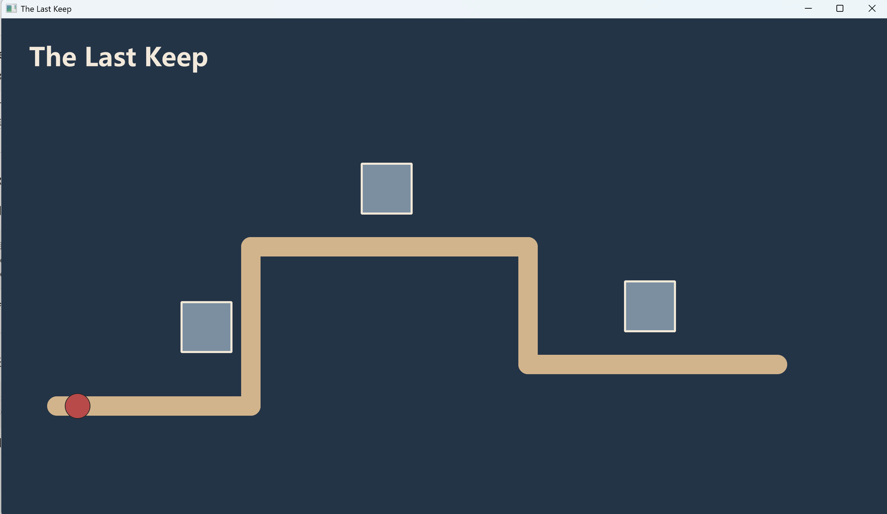
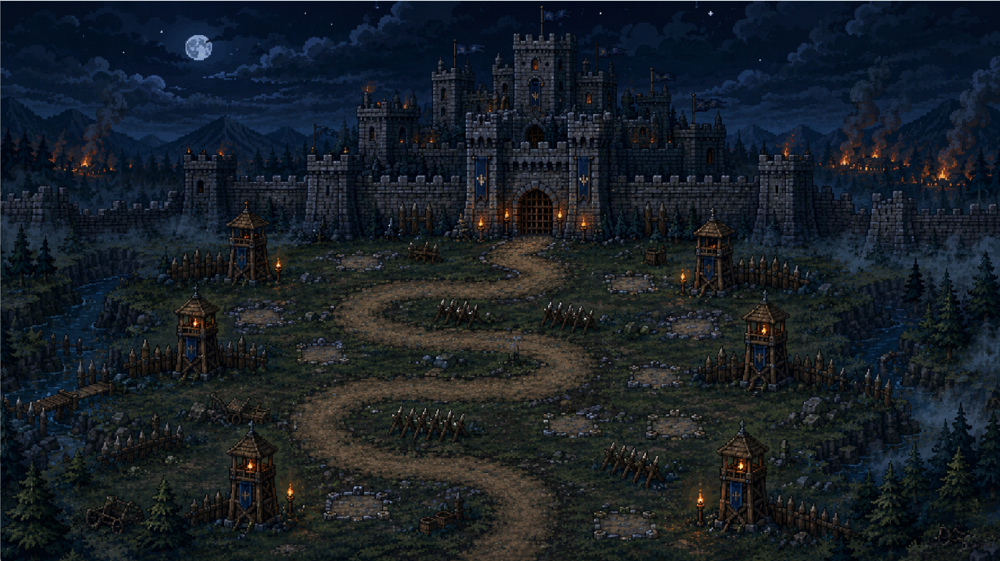

# 最后的要塞(The Last Keep)开发日志

## 2026/07/07

- 建立Qt CMake工程项目和目录结构
- 写出`MainWindow + GameScene + QGraphicsView`的基本框架，运行后显示游戏场景

创建完成后的项目结构

```
TheLastKeep/
├── CMakeLists.txt
├── main.cpp
├── mainwindow.h
├── mainwindow.cpp
└── mainwindow.ui
```

为了适合于工程开发，对项目结构做一定修改

```
TheLastKeep/
├── CMakeLists.txt
├── src/
│   ├── main.cpp
│   ├── ui/
│   │   ├── MainWindow.h
│   │   └── MainWindow.cpp
│   └── game/
│       ├── GameScene.h
│       └── GameScene.cpp
├── resources/
│   ├── resources.qrc
│   ├── images/
│   └── sounds/
```

可以看到场景是可以正常显示的


我们换成游戏主界面背景图


---

## 2026/07/08

### 代码合并与项目结构统一

将三位同学的代码合并到统一的 CMake 项目结构中：

```
TheLastKeep/
├── CMakeLists.txt
├── resources/
│   ├── resources.qrc
│   └── images/
│       ├── background.png
│       └── tutorialLevelMap.png
└── src/
    ├── main.cpp
    ├── ui/
    │   ├── Mainwindow.h / .cpp    ← 主窗口（菜单按钮信号槽）
    │   └── mainwindow.ui
    └── game/
        ├── GameScene.h / .cpp      ← 游戏场景（背景 + 菜单按钮 + 地图）
        ├── GameMap.h / .cpp        ← 网格地图系统
        ├── LevelData.h / .cpp      ← 关卡数据结构
        ├── LevelManager.h / .cpp   ← 关卡工厂（Tutorial Level）
        ├── enemy.h / .cpp          ← 5种敌人（哥布林/重甲/狼骑/巫师/Boss）
        ├── tower.h / .cpp          ← 5种塔（箭/法/炮/冰/圣）
        ├── bullet.h / .cpp         ← 追踪子弹
        ├── castle.h / .cpp         ← 城堡终点
        ├── gamecontroller.h / .cpp ← 金币 + 城堡血量
        ├── card.h / .cpp           ← 卡牌（空壳，待实现）
        └── cardmanager.h / .cpp    ← 卡牌管理（空壳，待实现）
```

### 各模块完成情况

| 模块 | 负责人 | 状态 |
|------|--------|------|
| 地图系统 (GameMap/LevelData/LevelManager) | 鱼浩琳 | ✅ 完成 |
| UI 框架 (MainWindow/GameScene) | 鱼浩琳 | ✅ 完成 |
| 敌人 (Enemy) | 陈思睿 | ✅ 完成 |
| 防御塔 (Tower) | 陈思睿 | ✅ 完成 |
| 子弹 (Bullet) | 陈思睿 | ✅ 完成 |
| 城堡 (Castle) | 陈思睿 | ✅ 完成 |
| 游戏控制器 (GameController) | 陈思睿 | ✅ 完成 |
| 卡牌系统 (Card/CardManager) | 陈思睿 | ⚠️ 空壳 |
| 波次系统 (WaveManager) | 待定 | ❌ 未开始 |

### 🚧 待处理

- [x] **开始游戏按钮 → Tutorial 关卡**：点击"开始游戏" → 隐藏菜单 → 调用 `loadTutorialLevel()` 加载地图
- [ ] **退出游戏按钮**：目前直接 `close()` 窗口，后期可加上确认弹窗
- [ ] **Card/CardManager 完善**：当前是空壳，需要实现卡牌生成 + 三选一 + Buff 应用
- [ ] **WaveManager 波次系统**：控制敌人按波次生成
- [ ] **各模块串联**：GameScene 中创建 Enemy 列表，Tower 攻击，Bullet 飞行，金币流转
- [ ] **美术资源替换**：Enemy/Tower 的 pixmap 路径指向 `:/assets/images/...`，需要实际图片
