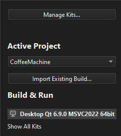
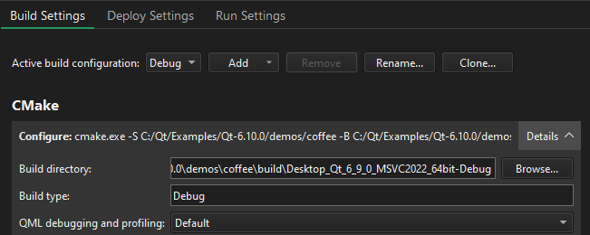
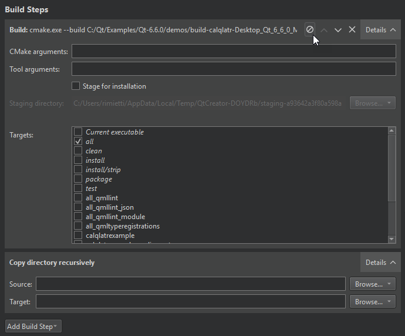

# 使用 Qt Creator 打包《最后的要塞》Windows 版本

整理于 2026/07/14

## 打包目标

这份文档记录《最后的要塞》在 Windows 下的完整打包过程。

之前的版本主要使用命令行完成编译和部署，步骤比较集中，但不适合不熟悉命令行的开发者操作。本次改为以 Qt Creator 和文件资源管理器为主，整个过程只需要选择配置、点击构建、复制文件和拖动程序。

打包完成后会得到：

1. 一个可以直接运行的游戏文件夹；
2. 一份可以发送给其他人的 ZIP 压缩包；
3. 游戏需要的 Qt 动态库、平台插件和多媒体组件；
4. 游戏运行时需要的字体文件。

本项目使用下面的开发环境：

| 项目 | 当前配置 |
|------|----------|
| 项目目录 | `E:\TheLastKeep\TheLastKeep` |
| Qt 版本 | Qt 6.11.1 |
| 编译器 | MSVC 2022 64-bit |
| Qt Creator Kit | Desktop Qt 6.11.1 MSVC2022 64bit |
| 打包目录 | `E:\TheLastKeep\TheLastKeep\dist\TheLastKeep-Windows-x64` |

如果以后更换 Qt 版本，界面文字可能略有变化，但操作顺序不变。

---

## 打包前检查

正式打包前，先在 Qt Creator 中运行一次游戏，至少检查以下内容：

1. 主界面能够正常显示；
2. 按钮点击音效和背景音乐正常；
3. 教程关卡、第一关、第二关和第三关都能进入；
4. 胜利和失败页面能够正常显示；
5. 关闭游戏时不再出现 Debug Error；
6. 中文字体显示正常。

如果当前版本仍然存在闪退，不建议直接打包。Release 版本不会自动修复程序逻辑问题，只会把当前代码编译成正式版本。

---

## 第一步：使用 Qt Creator 打开项目

打开 Qt Creator，选择：

```text
文件（File）
  → 打开文件或项目（Open File or Project）
  → 选择 E:\TheLastKeep\TheLastKeep\CMakeLists.txt
```

第一次打开项目时，Qt Creator 会要求选择 Kit。

选择：

```text
Desktop Qt 6.11.1 MSVC2022 64bit
```

不要选择 MinGW，也不要选择名称中带有旧版 Visual Studio 的 Kit。项目使用哪个 Kit 编译，后面就必须使用同一套 Qt 工具部署。



> 图片来源：[Qt Creator 官方文档：Building and running projects](https://doc.qt.io/qtcreator/creator-configuring-projects.html)

如果项目已经打开，可以点击 Qt Creator 左侧的“项目”按钮检查当前 Kit。官方文档中也可以使用 `Ctrl+5` 进入项目设置页面。

---

## 第二步：切换为 Release 构建

Debug 版本主要用于调试，会依赖 Qt 的调试库，不适合直接发送给其他人。正式打包时必须切换到 Release。

操作步骤：

1. 点击 Qt Creator 左侧的“项目”；
2. 选择 `Desktop Qt 6.11.1 MSVC2022 64bit`；
3. 进入“构建设置（Build Settings）”；
4. 在“编辑构建配置（Edit build configuration）”中选择 `Release`；
5. 检查构建目录，确认目录名称中包含 `Release`，并且不是原来的 Debug 目录。



> 图片来源：[Qt Creator 官方文档：Configure projects for building](https://doc.qt.io/qtcreator/creator-build-settings.html)

如果列表中没有 Release，可以点击“添加（Add）”，新建一个 Release 构建配置。

### 为什么要使用单独的 Release 目录

本项目之前出现过退出时提示 `Stack around the variable 'window' was corrupted`。其中一个风险是头文件修改后，旧的目标文件没有完全重新编译。

Release 使用独立目录后，Debug 和 Release 的中间文件不会混在一起，也可以减少旧文件造成的问题。

---

## 第三步：清理并重新构建项目

确认已经切换到 Release 后，依次选择：

```text
构建（Build）
  → 清理项目 TheLastKeep（Clean Project）
```

清理结束后，再选择：

```text
构建（Build）
  → 重新构建项目 TheLastKeep（Rebuild Project）
```

也可以直接点击 Qt Creator 左下角的锤子按钮进行构建，但第一次正式打包更建议使用“重新构建项目”。



> 图片来源：[Qt Creator 官方文档：Configure projects for building](https://doc.qt.io/qtcreator/creator-build-settings.html)

构建过程中，查看 Qt Creator 下方的“编译输出（Compile Output）”。

成功时应看到类似内容：

```text
The process exited normally.
```

或者：

```text
Build finished successfully
```

只要最后没有红色错误，并且成功生成 `TheLastKeep.exe`，就可以继续。

---

## 第四步：找到 Release 程序

仍然停留在“项目 → 构建设置”页面，找到“构建目录（Build directory）”。这个位置就是 Release 文件生成的位置。

点击构建目录右侧的“浏览”按钮，或者复制该路径后粘贴到文件资源管理器地址栏。

进入构建目录后，找到：

```text
TheLastKeep.exe
```

本次打包生成的 Release 主程序约为 63.5 MB。项目中的大部分图片、音效和故事文本已经通过 Qt Resource System 编译进程序，因此主程序较大是正常的。

### 如何确认没有拿错程序

检查以下几点：

- 文件来自 Release 构建目录；
- 修改时间与刚才重新构建的时间一致；
- 不要从旧的 Debug 目录复制；
- 不要使用之前压缩包中已经存在的程序。

---

## 第五步：建立发布文件夹

打开：

```text
E:\TheLastKeep\TheLastKeep\dist
```

如果没有 `dist` 文件夹，可以在文件资源管理器中右键新建文件夹。

在 `dist` 中建立：

```text
TheLastKeep-Windows-x64
```

如果这个文件夹中已经存在旧版本，先确认旧游戏已经退出，再删除旧文件夹或把它改名保存。不要直接把新 DLL 覆盖到旧文件中，否则旧插件可能残留。

将刚才找到的 Release 程序复制到发布文件夹中：

```text
E:\TheLastKeep\TheLastKeep\dist\TheLastKeep-Windows-x64\TheLastKeep.exe
```

此时文件夹里只有一个 EXE，还不能发送给其他人，因为 Qt 动态库和插件尚未复制。

---

## 第六步：使用 windeployqt 自动复制 Qt 依赖

Qt 官方提供了 `windeployqt.exe`。它会分析游戏程序需要哪些 Qt 库，然后自动复制 DLL、平台插件、多媒体插件和 FFmpeg 文件。

本机工具位置为：

```text
C:\Qt\6.11.1\msvc2022_64\bin\windeployqt.exe
```

本次不需要输入命令，直接使用拖动方式：

1. 用一个文件资源管理器窗口打开：

   ```text
   C:\Qt\6.11.1\msvc2022_64\bin
   ```

2. 找到 `windeployqt.exe`；
3. 再用另一个窗口打开发布文件夹；
4. 按住发布文件夹中的 `TheLastKeep.exe`；
5. 把它拖到 `windeployqt.exe` 上；
6. 松开鼠标，等待黑色窗口自动执行完成。

拖动时目标必须是 Qt 6.11.1 的 MSVC 2022 64-bit 目录。不要拖到 `mingw_64` 下的工具，也不要使用其他 Qt 版本的 `windeployqt.exe`。

Qt 官方说明，`windeployqt` 会扫描 EXE 并收集所需的 Qt 库、插件和运行时依赖。对于当前的 Release 程序，工具会把依赖放到 EXE 所在的发布文件夹中。

[Qt for Windows - Deployment 官方文档](https://doc.qt.io/qt-6/windows-deployment.html)

### 部署完成后的目录

执行完成后，发布文件夹中会新增很多 DLL 和插件目录，主要包括：

```text
TheLastKeep-Windows-x64
├── TheLastKeep.exe
├── Qt6Core.dll
├── Qt6Gui.dll
├── Qt6Widgets.dll
├── Qt6Multimedia.dll
├── Qt6Network.dll
├── platforms
│   └── qwindows.dll
├── imageformats
├── multimedia
├── styles
└── 其他 Qt 和 FFmpeg 文件
```

这些文件不能随意移动。尤其是：

```text
platforms\qwindows.dll
```

必须保留在 `platforms` 子目录中。

---

## 第七步：复制游戏字体

当前项目的图片、音效和故事文本已经编译进 EXE，但字体仍然会从磁盘读取，因此需要单独复制。

在项目目录中找到：

```text
E:\TheLastKeep\TheLastKeep\resources\fonts
```

在发布目录中建立相同结构：

```text
TheLastKeep-Windows-x64
└── resources
    └── fonts
```

将项目中的整个 `fonts` 文件夹复制到发布目录的 `resources` 文件夹中。

最终路径应为：

```text
E:\TheLastKeep\TheLastKeep\dist\TheLastKeep-Windows-x64\resources\fonts
```

不要只复制字体文件到 EXE 旁边，因为程序按照 `resources/fonts` 查找字体。

---

## 第八步：运行发布版本

不要再从 Qt Creator 中启动游戏，直接双击发布文件夹中的：

```text
TheLastKeep.exe
```

这样可以检查程序是否真正依靠发布目录运行，而不是借用了 Qt Creator 的开发环境。

重点验收：

1. 游戏能够进入主界面；
2. 中文字体显示正常；
3. 按钮点击音效正常；
4. 背景音乐正常；
5. 关卡背景和敌人贴图正常；
6. 至少进入一次实际关卡；
7. 关闭窗口后没有 Debug Error；
8. 任务管理器中不再残留 `TheLastKeep.exe`。

如果程序能够正常打开，但没有声音，优先检查 `Qt6Multimedia.dll`、`multimedia` 文件夹和 FFmpeg DLL 是否存在。

---

## 第九步：压缩为 ZIP

确认发布目录可以正常运行后，先关闭游戏，然后返回：

```text
E:\TheLastKeep\TheLastKeep\dist
```

右键点击：

```text
TheLastKeep-Windows-x64
```

Windows 11 选择：

```text
压缩为 ZIP 文件
```

部分 Windows 版本需要选择：

```text
发送到
  → 压缩（zipped）文件夹
```

最终得到：

```text
TheLastKeep-Windows-x64.zip
```

本次打包结果约为 186 MB。以后增加图片、音效或字体后，体积发生变化是正常的。

### 压缩完成后再次检查

双击打开 ZIP，确认最外层只有一个游戏文件夹，并且其中包含：

```text
TheLastKeep.exe
platforms\qwindows.dll
resources\fonts
Qt6Core.dll
Qt6Widgets.dll
Qt6Multimedia.dll
```

最好把 ZIP 解压到一个新的临时目录，再运行一次解压后的 `TheLastKeep.exe`。

---

## 常见问题

### 1. Qt Creator 中没有 Release

进入：

```text
项目
  → 构建设置
  → 编辑构建配置
  → 添加
  → Release
```

如果整个 Kit 都不存在，进入 Qt Creator 的“首选项 → Kits”检查 Qt 版本和编译器。

### 2. 构建时出现 STL1001

这通常说明编译器和 C++ 标准库版本混用了。

检查当前 Kit 是否为：

```text
Desktop Qt 6.11.1 MSVC2022 64bit
```

然后删除有问题的构建配置，重新建立一个 Release 配置。不要继续使用已经混入其他编译器文件的旧构建目录。

### 3. 拖到 windeployqt 后没有任何变化

先检查拖动的是发布目录中的 `TheLastKeep.exe`，不是 Qt Creator 的快捷方式，也不是 ZIP 中的文件。

然后检查使用的工具是否为：

```text
C:\Qt\6.11.1\msvc2022_64\bin\windeployqt.exe
```

如果黑色窗口显示错误后立刻关闭，可以在 Qt Creator 中进入：

```text
项目
  → 构建设置
  → 构建环境
  → 打开终端
```

这时再按照 Qt 官方文档执行部署命令，用于查看完整错误信息。正常打包不需要进入这一步。

### 4. 程序提示找不到 Qt platform plugin

检查：

```text
platforms\qwindows.dll
```

如果文件不存在，重新把 EXE 拖到正确版本的 `windeployqt.exe` 上。不要把 `qwindows.dll` 单独移动到 EXE 旁边。

### 5. 游戏可以打开，但没有声音

检查发布目录中是否存在：

- `Qt6Multimedia.dll`；
- `multimedia` 插件目录；
- FFmpeg 相关 DLL。

缺少这些文件时，重新运行 `windeployqt`。

### 6. 中文字体与开发时不同

检查：

```text
resources\fonts
```

这部分是项目自己的运行时资源，不由 `windeployqt` 自动复制。

### 7. 压缩时提示字体文件被占用

说明游戏进程还没有完全退出。

处理步骤：

1. 关闭游戏窗口；
2. 打开任务管理器；
3. 检查是否还有 `TheLastKeep.exe`；
4. 等待文件释放后重新压缩。

### 8. 在自己电脑能运行，在其他电脑不能运行

自己的电脑已经安装 Qt 和 Visual Studio，可能会掩盖缺失依赖。

最终发布前，最好在一台没有安装 Qt Creator 的 Windows 电脑上测试。如果系统提示缺少 Visual C++ 运行库，应安装微软官方的 Visual C++ Redistributable，不要从开发电脑手工复制来源不明的运行库 DLL。

---

## 最终验收

完成打包后，按照下面的列表检查：

- [ ] Qt Creator 当前使用 MSVC 2022 64-bit Kit；
- [ ] 构建配置为 Release；
- [ ] 执行过清理和重新构建；
- [ ] 发布目录中使用的是最新 `TheLastKeep.exe`；
- [ ] 已使用对应 Qt 版本的 `windeployqt.exe`；
- [ ] `platforms\qwindows.dll` 存在；
- [ ] 多媒体和 FFmpeg 文件存在；
- [ ] `resources\fonts` 已复制；
- [ ] 从发布目录直接启动正常；
- [ ] 音乐、音效、图片和字体正常；
- [ ] 关卡可以进入并正常结束；
- [ ] 游戏可以正常退出；
- [ ] ZIP 可以解压并运行。

---

## 总结

本次打包流程为：

```text
Qt Creator 选择正确 Kit
  → 切换 Release
  → 清理并重新构建
  → 在构建目录找到 TheLastKeep.exe
  → 复制到独立发布文件夹
  → 将 EXE 拖到 windeployqt.exe
  → 复制 resources\fonts
  → 直接运行发布版本
  → 使用文件资源管理器压缩为 ZIP
```

Qt Creator 负责生成正式程序，`windeployqt` 负责补齐 Qt 运行依赖，文件资源管理器负责整理和压缩。三部分都完成后，才是一份可以交给其他人测试的 Windows 发布包。

## 官方文档参考

- [Qt Creator：Building and running projects](https://doc.qt.io/qtcreator/creator-configuring-projects.html)
- [Qt Creator：Configure projects for building](https://doc.qt.io/qtcreator/creator-build-settings.html)
- [Qt for Windows - Deployment](https://doc.qt.io/qt-6/windows-deployment.html)