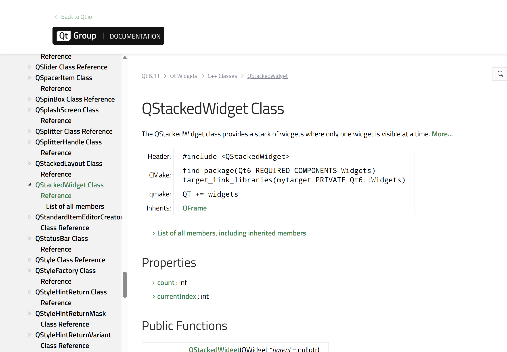

# 使用Qt Widgets实现页面切换的解决方案

鱼浩琳 写于2026/07/09

## 问题描述

在使用Qt Widgets开发游戏时，需要实现不同页面之间的切换功能。
具体来讲，在我们的项目中需要实现从 **开始页面** 到 **引导关卡** 的切换，或者进一步，到第一关卡，第二关卡等的切换。

## 中间解决方案

在 Qt 官方文档中，推荐使用 `QStackedWidget` 来实现页面切换。`QStackedWidget` 是一个容器控件，它可以包含多个子控件（页面），并且只显示其中的一个子控件。通过调用 `setCurrentIndex()` 方法，可以轻松地在不同页面之间切换。

[QStackedWidget 官方文档](https://doc.qt.io/qt-6/qstackedwidget.html)



但是官方文档的示例代码

```cpp
QComboBox *pageComboBox = new QComboBox;
pageComboBox->addItem(tr("Page 1"));
pageComboBox->addItem(tr("Page 2"));
pageComboBox->addItem(tr("Page 3"));
connect(pageComboBox, &QComboBox::activated,
        stackedWidget, &QStackedWidget::setCurrentIndex);
```

使用 `QComboBox` 来切换页面，这种方式在游戏开发中并不适用，因为游戏通常需要通过按钮点击或其他交互方式来切换页面，而不是通过下拉菜单。

不过我们可以学习官方文档的解决方案，将槽函数`slot()`直接链接到按钮的点击事件上，从而实现页面切换。

```cpp
connect(button, &QPushButton::clicked, this, [=]{
    stackedWidget->setCurrentWidget(gamePage); // 切换到游戏页面
});
```

简单解释一下这个代码片段：
- `button` 是一个 `QPushButton` 对象，表示用户点击的按钮
- 当按钮被点击时，触发 `clicked` 信号
- `this` 表示当前对象，通常是一个继承自 `QWidget` 的类
> 对我们这些初学者来说，可以默认写成 `this`，因为我们通常在类的成员函数中使用 `connect()`，所以 `this` 指向当前类的实例。
- 使用 lambda 表达式作为槽函数，调用 `stackedWidget->setCurrentWidget(gamePage)` 来切换到指定的页面（例如游戏页面）
> 关于这个lambda表达式 `[=]` 表示捕获外部作用域的所有变量，允许在槽函数中访问这些变量。

很可惜，在实现以上方案的过程中，发现 `QStackedWidget` 切换界面后并不会终止界面，会导致游戏运行逻辑的问题。决定使用下面的方案。

## 第二版(目前使用的方案)

```cpp
connect(m_scene, &GameScene::sigStartGame, this, &MainWindow::onStartGame, Qt::QueuedConnection);
```

- 依然是使用 `connect()` 来连接信号和槽函数
- `m_scene` 是一个 `GameScene` 对象，表示游戏场景
- `sigStartGame` 是一个自定义的信号，表示游戏开始的事件
- `this` 表示当前对象
- `onStartGame` 是一个槽函数，用于处理游戏开始的逻辑
- `Qt::QueuedConnection` 表示使用队列连接方式，这样可以确保槽函数在主线程中执行，避免多线程问题。

事实上，在实现相关逻辑的过程中，因为 `onStartGame` 逻辑如下

```cpp
void MainWindow::onStartGame()
{
    qDebug() << "开始游戏 → 加载 Tutorial 关卡";

    // 加载教程关卡地图（clear() 会清除菜单按钮，显示地图）
    m_scene->loadTutorialLevel();

    // 场景大小可能变化，同步更新视图
    m_view->setSceneRect(m_scene->sceneRect());
}
```

而 `loadTutorialLevel()` 的逻辑如下

```cpp
void GameScene::loadTutorialLevel() {
    LevelData tutorialLevel = LevelManager::createTutorialLevel();

    m_map.loadLevel(tutorialLevel);

    clear();

    setSceneRect(
        0,
        0,
        m_map.cols() * m_map.tileSize(),
        m_map.rows() * m_map.tileSize()
        );

    m_map.drawBackground(this);

    // 调试阶段建议都打开
    m_map.drawDebugTiles(this);
    m_map.drawGrid(this);
    m_map.drawWayPoints(this);

    // 强制刷新场景显示
    update();
}
```

loadTutorialLevel() 方法中调用了 `clear()`，这会清除菜单按钮，然而开始游戏的按钮也在 GameScene 中，这将导致以下场景

```
用户正在点击按钮
按钮的 clicked 信号还没完全处理完
你就在 clicked 的处理过程中 clear() 了场景
clear() 把按钮自己删了
Qt 后面还想继续处理这个按钮事件
结果访问了已经删除的对象
闪退
```

使用 `Qt::QueuedConnection` 可以将槽函数的执行延迟到事件循环的下一次迭代中，这样可以确保在按钮点击事件完全处理完之后再执行 `onStartGame()`，从而避免访问已经删除的对象导致的闪退问题。

> 但是我们需要承认，这样的架构设计仍然存在风险，理想情况其实是使用 `QStackedWidget` 来管理不同的页面，而不是在同一个场景中动态清除和加载内容。这样可以更好地分离不同页面的逻辑，减少潜在的错误。
